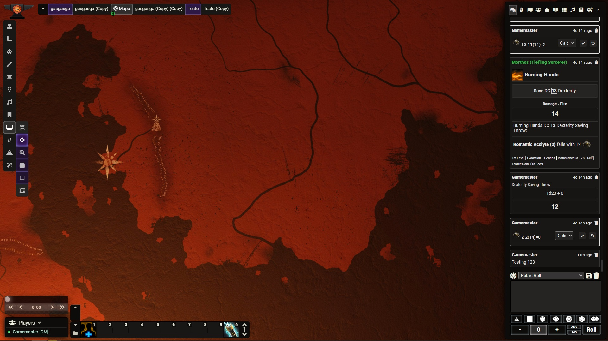
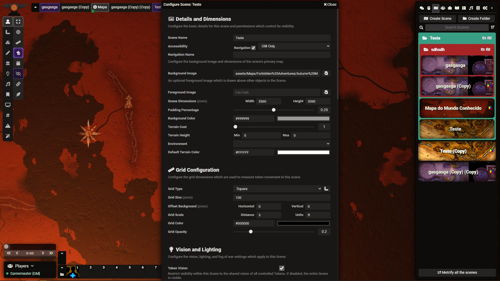
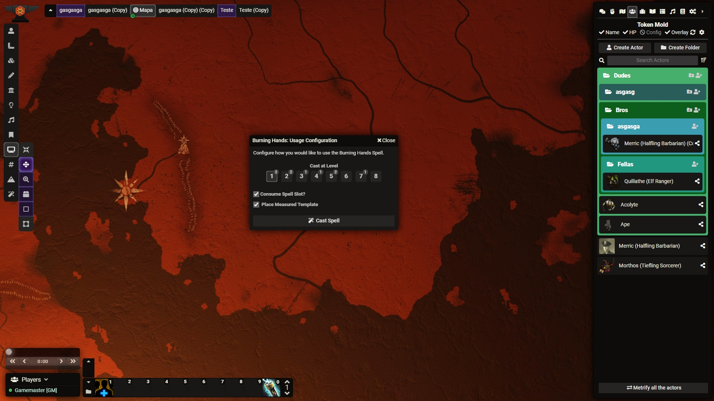
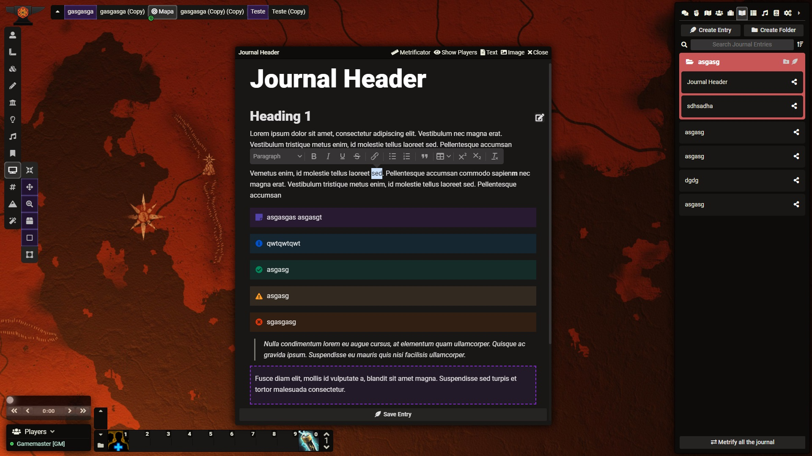
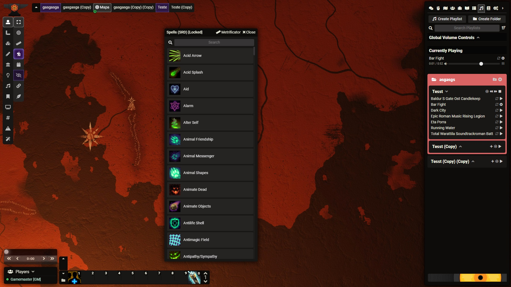

# Twilight UI
A dark theme for Foundry VTT. It adds some padding to pretty much everything, a Legend Keeper style journal, better folders, and replaces the spell level selection dropdown menu with buttons. It has been tested with the DnD 5e system, and I recommend you use the tidy5e sheet (in dark mode) with it. If you have any feedback, please feel free to message on Discord @Sua mãe, Aquela Católica#2512.

# Screenshots

