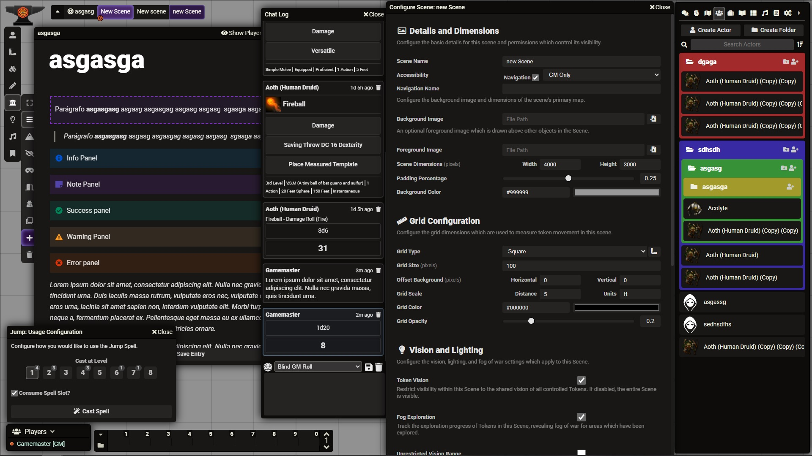

# Twilight UI
A dark theme for Foundry VTT. It adds some padding to pretty much everything, a Legend Keeper style journal, better folders, and replaces the spell level selection dropdown menu with buttons. It has been tested with the DnD 5e system, and I recommend you use the tidy5e sheet (in dark mode) with it. If you have any feedback, please feel free to message on Discord @Sua mãe, Aquela Católica#2512.

# Help Wanted!
This is my first module and I'm not a developer, so there are a few features I wanted to implement but didn't really have the technical knowledge to do it. If you would like to help me, I would really like to:

- add a todo-list block, and generally just know how to add blocks with other html elements inside of it;
- enable slash commands for the journal ([This link](https://www.tiny.cloud/blog/slash-commands-rich-text-editor/) explains how to do it, I just don't know how to implement it in Foundry);
- group some of the icons on the toolbar, so that it doesn't take so much space.

# Screenshots

# Credits

The whole thing is based on [Legend Keeper](https://www.legendkeeper.com/)'s UI. The journal mimics pretty much 1:1 the logend Keeper interface.